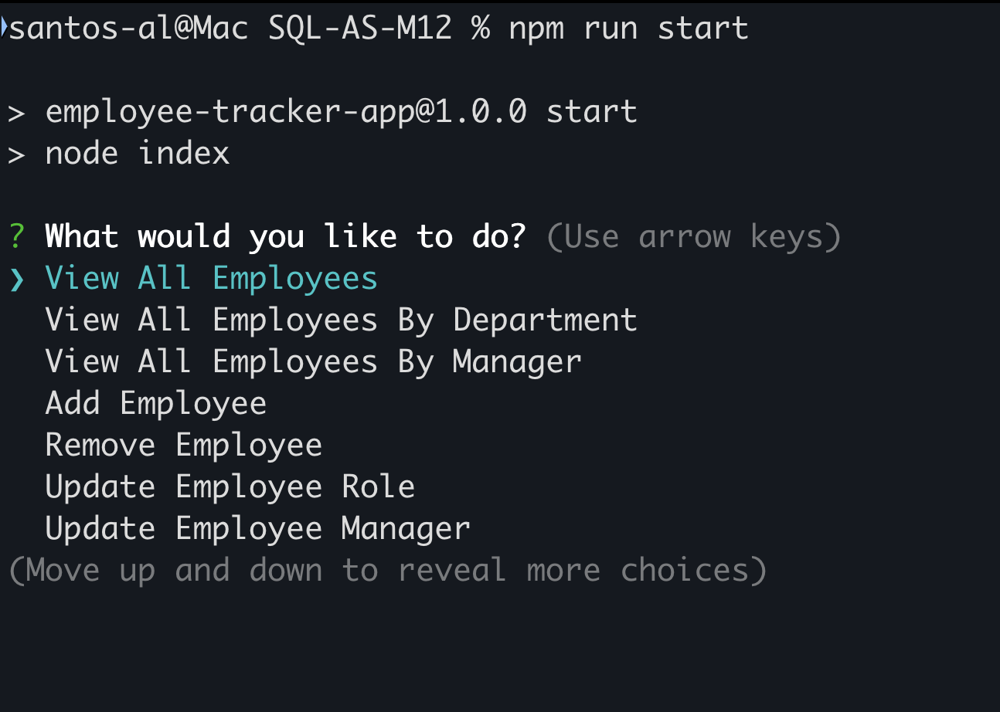
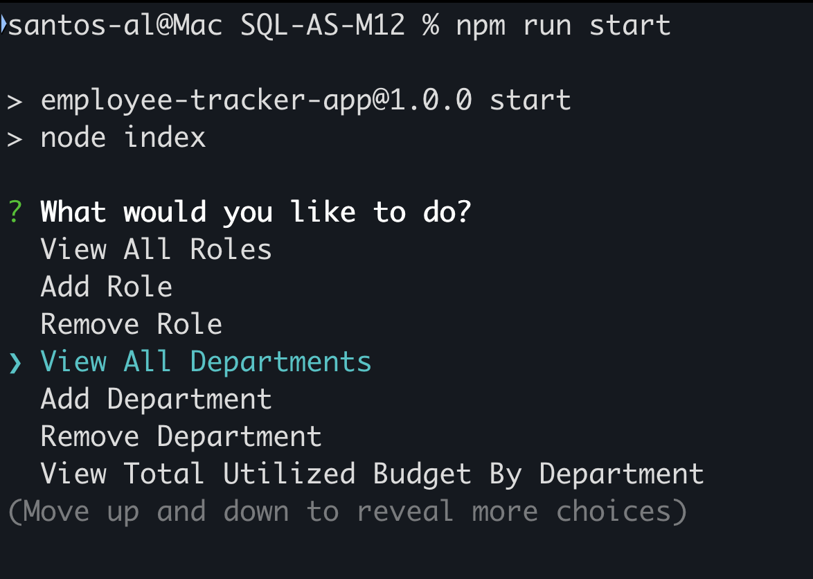
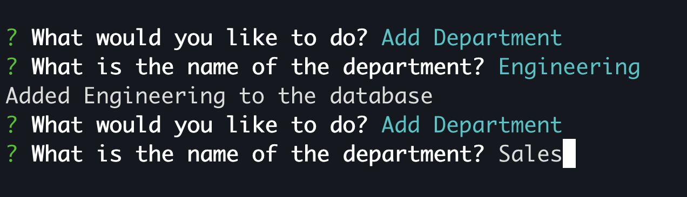
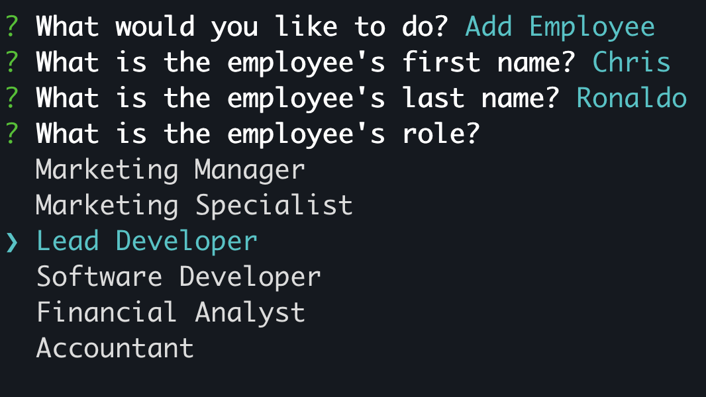
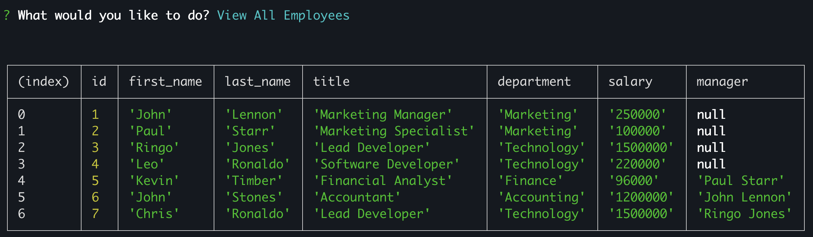
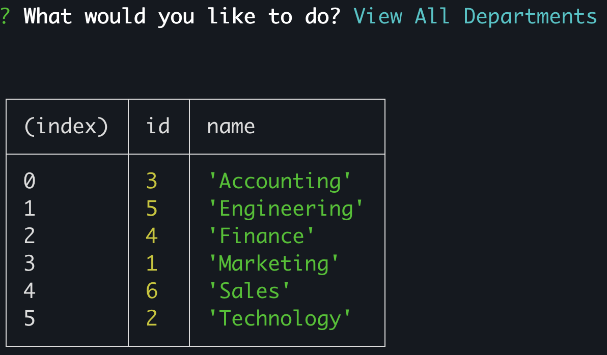
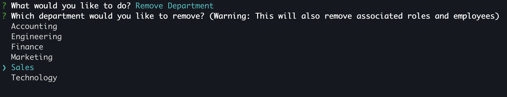
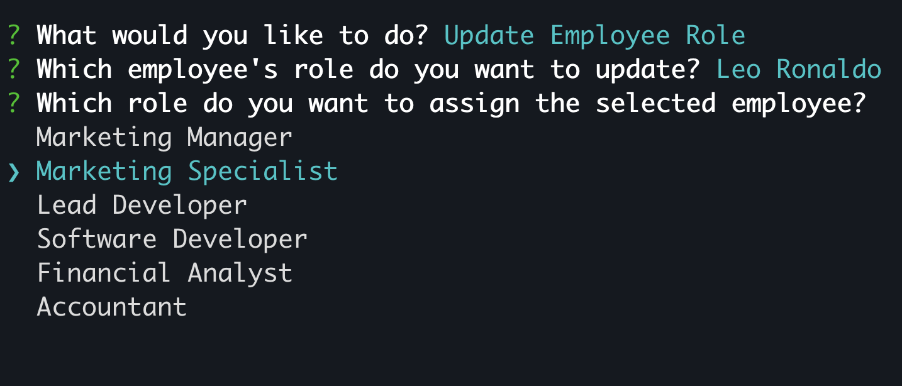
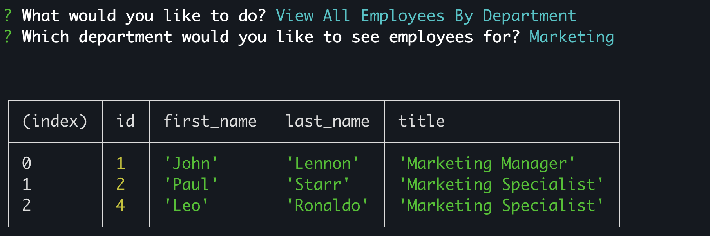

# MySQL Employee Tracker

## Description
The MySQL Employee Tracker is a command-line application designed to help manage and track employee information within a company. Built using <b>Node.js</b> and <b>MySQL</b>, this application allows users to perform <b>CRUD</b> (Create, Read, Update, Delete) operations on employee data directly from the terminal. Utilizing the <b>Inquirer</b> package, it prompts users for input, making it easy to add, view, update, or remove employees, departments, and roles. This tool serves as a solution for managing a company's workforce efficiently.


## Table of Contents

- [Description](#description)
- [Home](#home)
- [Features](#features)
- [Technologies Used](#technologies-used)
- [Installation](#installation)

## Home

The following screenshots show the applications home screen and its functionalities.





## Features

### **Feature 1**: Add Employee, Department, or Role.

Once the user selects the "Add Department" button, the user will be prompted for the departments name. Once the name has been entered the department is added to the database. The second screenshot shows the "Add Employee" functionality.





### **Feature 2**: View All Employees, or filter them by Department or Manager.

The next two screenshots show the viewing functionality of the application. This first screenshot id displayed when the user clicks "View All Employees"





### **Feature 3**: Remove Employee, Department, or Role.

This application also allows the user to remove data from the database. The following two examples show an employee being removed and department being removed.




### **Feature 4**: Update Employee Manager or Role.

The final feature of this application is updating the database. The following screenshots show how the user can update an employees role. The second screenshot shows the updated employee's role by viewing all employees in the marketing department.





## Technologies Used

- **Language**: JavaScript
- **Database**: MySQL
- **Other Libraries/Tools**: Node.JS, Inquirer, Dotenv

## Installation

Provide a step-by-step guide on how to install your project. For example:

1. Clone the repository:
   ```bash
   git clone https://github.com/santos-al/SQL-AS-M12.git
2. Install Dependencies:
   ```bash
   npm i
3. Start Application:
   ```bash
   npm run start